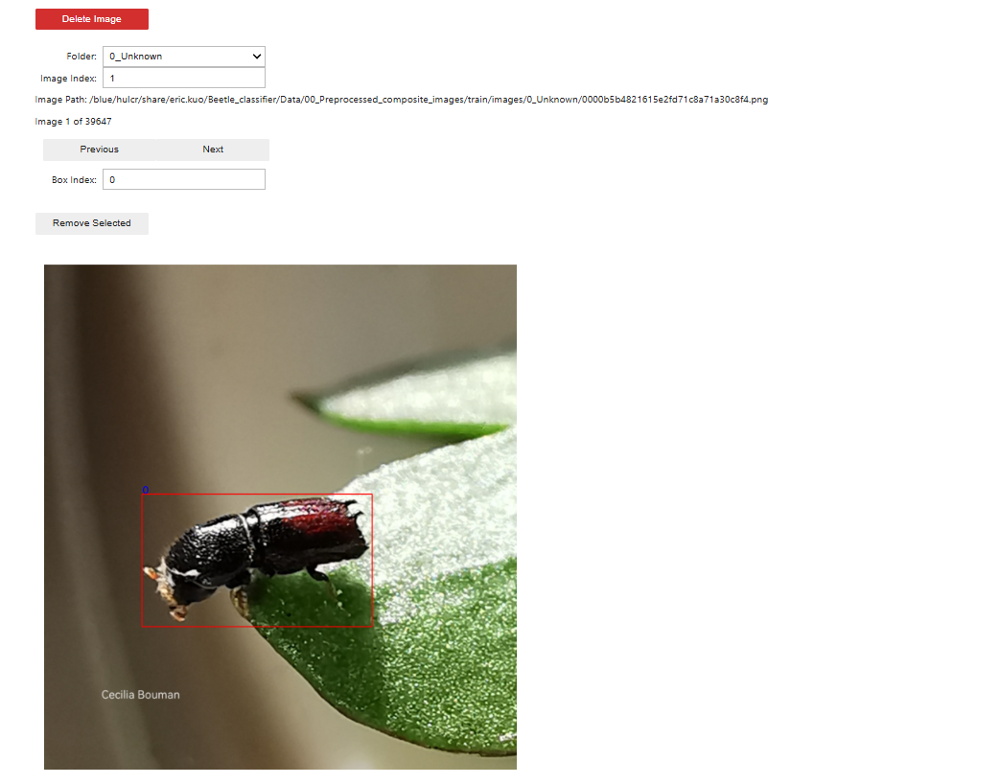

# Bark Beetle Object Detection

## Overview
This project focuses on building an object detection model to detect **bark beetles** — a small insects that threaten forests if invasive. The aim is for the model to detect both **individual beetles** and **clusters of beetles**, whether in the wild or in lab petri dishes. The model will be used as part of a image classifier model to identify the species.

## Problem
General-purpose detection models tend to underperform on small-scale objects like bark beetles, especially when:

- Beetles are very small in the image.
- Beetles are densely clustered or partially occluded.
- Beetles appear in varying backgrounds — from bark textures to sterile lab environments.

Our objective is to create a dataset and a model that can robustly detect bark beetles across diverse image settings.

## Dataset

**Initial Dataset Size:** ~58,000 images  
**Challenge:** No bounding box annotations available.

To quick start the annotation process, a semi-supervised pipeline was developed using **GroundingDINO** to generate initial bounding boxes. These labels were then used to train a series of **YOLOv10** models in iterative fashion. Meaning, the next model will train on the labels generated from the previous model.

### Detection Counts Per Iteration
The number of detections per iteration was used as a proxy metric for model improvement, since ground truth annotations were not available yet.

| Model         | Detections |
|---------------|------------|
| GroundingDINO | 173,503    |
| YOLOv10 - v1  | 177,127    |
| YOLOv10 - v2  | 178,396    |
| YOLOv10 - v3  | 179,681    |
| YOLOv10 - v4  | 180,557    |
| YOLOv10 - v5  | 210,098    |
| YOLOv10 - v6  | 211,986    |
| YOLOv10 - v7  | 215,083    |
| YOLOv10 - v8  | 217,753    |
| YOLOv10 - v9  | 219,882    |

We can see that with each iteration, the number of detections steadily increased. This created a strong starting point for **human-in-the-loop label correction**, allowing manual reviewers to refine the bounding boxes.

## Label Correction Workflow

To make the label refinement process more efficient, I developed a **bounding box editor** inside a Jupyter Notebook. This tool allows users to:

- Quickly view each image with its predicted bounding boxes.
- Delete incorrect boxes (e.g., boxes around rocks, overlapping beetles, or multiple beetles in one box).
- Navigate efficiently through the dataset.

In addition to removing bad labels, I also observed **missing detections** — where beetles re present but not labeled. To handle this, the editor was used in conjunction with the **`labelme`** annotation tool to manually add missing bounding boxes.

Thanks to the reduced editing required from the semi-supervised labeling pipeline, we were able to efficiently create a **fully labeled object detection dataset of 58,000 images**.

## Model Evaluation

With the finalized labeled dataset, I am now working on benchmarking a set of state-of-the-art object detection architectures:

- **YOLOv10**
- **YOLOv11**
- **DETR (DEtection TRansformer)**
- **Co-DETR (Context-enhanced DETR)**

To ensure robust evaluation, I am using **5-fold cross-validation** to compare each model's performance across metrics such as:

- Mean Average Precision (mAP)
- Precision / Recall
- Inference Speed
- Detection robustness on small clustered objects

The best-performing model will be selected

### mAP50-95
| Fold | YOLOv10          | Co-DETR          |
|------|------------------|------------------|
| 1    | 0.97848          | 0.931            |
| 2    | 0.95066          | 0.923            |
| 3    | 0.97371          | 0.942            |
| 4    | 0.96982          | 0.930            |
| 5    | 0.97123          | 0.945            |

More results soon to come!
